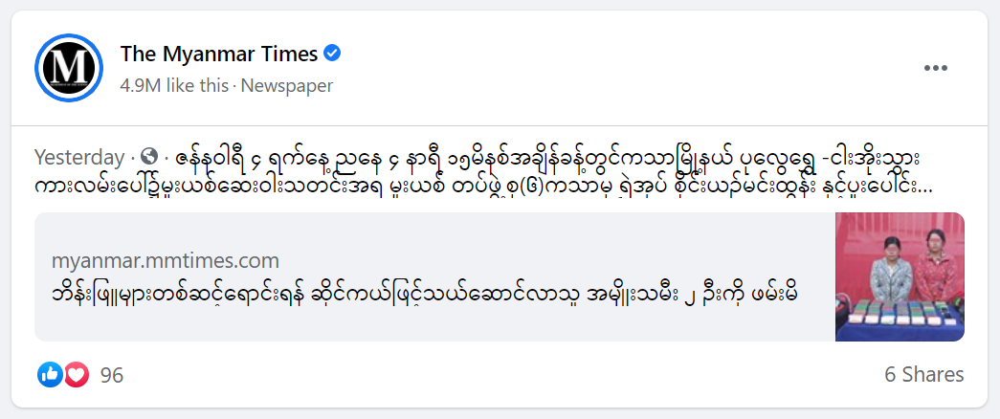

# Data Quality Analysis on Facebook Search Results
---


## Background

Many social media platforms have the ability for users to search on topics they are interested in, and generally have News tabs where articles from across the world are aggregated to engage each user. With the development of the information age, the authenticity and reliability of these news articles are becoming paramount for the continued success of these platforms. Therefore, many Data Quality Analysts are using candid methods for assessing the search results of these platforms to provide reliable feedback.

According to the [global statistics](https://gs.statcounter.com), Facebook has the largest global market share amongst the other prominent social media platforms. In addition to providing a digital platform for friendships and connections for users, Facebook also provides a place for many individuals and organizations to advertise their businesses, post pictures, and videos, and share news articles.  


With the increased number of users and information shared on the platform, Facebook search results must provide top quality content with little or no irrelevant result. As current and future data analysts, we will explore the qualitative and technical analysis that can be implemented to improve the search results of a selected topic.

To improve search results on Facebook, we must explore these six steps:

1. [Topic Selection](#Topic-Selection)
2. [Data Quality Guidelines for Better UX](#Data-Quality-Guidelines-for-Better-UX)
3. [Maintenance and Replication of the Guidelines](#Maintenance-and-Replication-of-the-Guidelines)
4. [Barriers and Limitations](#Barriers-and-Limitations)
5. [Challenges for Accuracy and Consistent Use of Guidelines](#Challenges-for-Accuracy-and-Consistent-Use-of-Guidelines)
6. [Special Considerations for Burmese View Points](#Special-Considerations-for-Burmese-View-Points)

---
### Topic Selection

In the selection of topics, Data Analysts must account for the pain points of the platform. Currently, there is a growing demand for content moderation for Facebook in Myanmar. After 2011, Myanmar, previously known as Burma, underwent a transition from oligarchy to democracy. Many foreign countries have invested heavily in Myanmar's infrastructure and telecommunication systems ever since. As of December 2020, there are 28,530,000 Facebook users in Myanmar according to [NapoleonCat.com](https://napoleoncat.com/stats/facebook-users-in-myanmar/2020/12). The graph below describes the demographic of Burmese Facebook users.


Now, Facebook occupies 52.78% of Myanmar's population users. It started when the smartphone dealerships pre-included Facebook application on the phone and educated many people on how to use it for free when the customer purchases the smartphone. The problem begins when many Burmese people use the platform for the main source of information from credible News to less credible posts amidst the continuing transition of its political system. Hence, Facebook search results for Burmese related content can occasionally be filled with politically motivated, racially charged, and misleading information.

Therefore, we will start providing feedback on the search results by searching for 'Myanmar News' on Facebook. 

| Search Results on All/General page section |
| ------------------------------------------ |
|  |

In the picture above, the user can see the aggregate results given back after the search query for 'Myanmar News'. The news includes topics ranging from Myanmar political news to celebrity and entertainment news. The User Interface of Facebook provides the user with a variety of options to choose from. It includes the option to view normal publically available posts, pictures, or videos from Pages and People, and the option to only view what the user's friends posted that is related to the search query, and many more.  

The content gets more relevant as the users get specific on their choices. However, we should aim to provide better access for mainstream credible news sources to the users in the general search result section.   

 | [Link: BBC Learning English](https://bbc.in/3nj6tER) | 
 | ---------------------------------------------- | 
 |   |
 
 | [Link: No Snake Soup for Hong Kong’s Young Snake Catcher](https://bit.ly/38j60hC) | 
 | ---------------------------------------------- | 
 |   |
 
 | [Link: The Ethical Life Podcast](https://bit.ly/3npUrcS) | 
 | ---------------------------------------------- | 
 |   |
 
The three articles above are linked in the article section of the search result. However, these are not related to the topic of 'Myanmar News'. The first article link is by a credible news source, [BBC.com](https://www.bbc.com). However, it requires the users to click multiple sub-links when they arrive at its home page. Even then, it requires another search input to view Myanmar News.
 
The second article is repeated twice on the same search result page, and it is an article about a Hong Kong snake catcher who captured a Burmese python. The third article also shares similar attributes with both the first and the second articles. The third article has a sub-link that leads to an article about the discovery of Burmese python in Florida, which is not relevant to the search query.

---
### Data Quality Guidelines for Better UX

To improve the quality of the content and increase the access to the mainstream news about 'Myanmar News', Data Analysts and Data Quality Analysts must commit to a set of guidelines designed for a better user experience. 

__1.__ Many credible news sources have their pages that they use to share or post their news articles. We can use their official verification mark and user engagement of the page to rank them in our search results.

| Example of Verification Mark and Amount of Likes | 
| ----------------------------------------------   | 
|     |

__2.__ The articles are great sources to assess the quality of the content. We can qualitatively measure the amount of main content the article includes and assign a rank based on the result.

__3.__ Afterwards, we can verify the author's credibility. A credible news website will hyperlink to the author's profile where the readers can view more content written by the author.

| Assess the Authorship of the Article |
| ------------------------------------ |
|  |

| Check for Credibility of the Author |
| ------------------------------------ |
|  |

__4.__ Fourth is to check for relevancy. We need to identify the name entities such as "Burmese python" that have Burmese in it but might not be relevant to Myanmar or any other Burmese related news.

__5.__ Finally, we can rank the articles based on the date by assigning the highest rank to the most up-to-date articles. 

If we follow these guidelines, we can ensure that the users are getting the most up-to-date, relevant, and credible news from Facebook. 

---
### Maintenance and Replication of the Guidelines

For the maintenance of Data Quality Guidelines, we need a uniform set of metrics that all Data Quality Analysts can use to implement across the board. We can use the guidelines from above with the article found in the search result for the demonstration.

##### Article: [2 Women Detained for Illegal Cocaine Trafficking on Motorcycles](https://bit.ly/35j8RoV)

* Guideline no.1: Article by a leading Myanmar news network, Myanmar Times. 

```python
   # No = 0, Yes = 1
   Verified, Score = 1
```
* Guideline no.2: The Author clearly explained the cause, effect, and resolution of the crime.

```python
   # Content quality rating on Low = 1, Medium = 2, High = 3
   High, Score = 3
```
* Guideline no.3: The author has a history of writing crime-related articles.

```python
   # No = 0, Yes = 1
   Credible, Score = 1
```
* Guideline no.4: Relevant to Myanmar News.

```python
   # No = 0, Yes = 1
   Relevant, Score = 1
```
* Guideline no.5: Article is dated Jan 5th, 2021.

```python
   # Outdated = 0, Recent = 1
   Recent, Score = 1
```
Using the quantitative metrics on the Guideline scoring manual, other Data Quality Analysts will be able to effectively replicate the process with ease. The following matrix is a mock-up scoring sheet that others can use to input their ratings.

| Content-Type | Characteristics | Rating and Explanation |
| -----------  | --------------- | ---------------------- |
| [Article](https://bit.ly/35j8RoV) about drug trafficking in Burma | Score: 7/7 | High. Met every Guideline standards |
| Sample Article | Score: 3/7 | Low. No author, low quality, outdated |

---
### Barriers and Limitations

__1. User Engagement Metrics__

There is a limitation for using User Engagement in the News aspect because there are articles that the Facebook search engine returns without the Page but with just the main website URL. One way to mitigate the limitation is to create a ranking index of credible website URLs that host Myanmar News. However, the ranking index needs to be checked and updated at least once a week for any additional credible organizations entering the Facebook platform.  

__2. Technology__

There is an easier way to rate user engagement of the Pages to rank if Facebook allows its Graph API to be used in pulling comments from Pages for the Data Analysts to conduct sentiment analysis on. However, it is also an opportunity for a new project where an Analyst can use creative methods to accomplish better User Engagement ratings using sentiment analysis.

These will be the general steps to take if we are able to use Facebook Graph API in the way we desire:

1. Request for Facebook user comment data for a target Page using Graph API.
2. API Response with the Facebook Data.
3. Create a data storage process using either Jupyterlab or a local SQL Database.
4. Store the Facebook user comments in the chosen database storage. 
5. Use Natural Language Toolkit (NLTK) library on Jupyterlab to analyze the sentiments of the users for the target Page.
6. Rank the Page's user sentiments between negative, neutral, and positive.

However, negative reviews can always be created as an attack on a specific entity. Therefore, there must be some metrics to detect these instances.

* __Note__ :  Twitter Text API can pull tweets based on a targeted name which can at least provide the Analyst with the general user sentiment of the target after a sentiment analysis even though Facebook can provide better insights through its large user database. 

---
### Challenges for Accuracy and Consistent Use of Guidelines

__1. Challenges__

This case only shows a small set of guidelines to be applied to a specific topic. However, Data Quality Analysts are handling large sets of data from different topics.  So, there must be a strong understanding of data quality in the platform that the Analyst is operating on. Therefore, it is a challenge for everyone to learn about the guidelines and the system properly before they start providing feedback.

__2. Addressing the Challenges__

For a consistent usage of guidelines by the team, the team must have good synergy. It can be nurtured through group projects where everyone can contribute and learn. Updates on the changes must also be addressed in timely manner with everyone involved. By cultivating an interactive culture, the Data Quality Analyst team will maintain its accuracy and consistent usage of the Guidelines without errors. 

---
### Special Considerations for Burmese View Points

 

__1. ZawGyi Font, Unicode, and Myanglish__

Not only is Myanmar enduring a rough political climate, but the country's technology is also still developing. In 2019, Myanmar changed its official Burmese font from the traditional Zaw Gyi Font to Unicode. However, some people are still using Zaw Gyi Font out of convenience. Moreover, everyone who finished high school education in Myanmar has an average ability to read and write in English even though they may not hold a conversation fluently. Therefore, there are also people using Myanglish, a combination of the English language and the Myanmar language.

__2. Implications on Racism__ 

With the amount of user market share that Facebook owns in Myanmar, people can use it with bad intentions. As Rohingya Muslims are being targeted more and more by many racist extremists and politically motivated individuals, international scrutinity on Myanmar has also increased. As many people are still using different techniques to use racially insensitive languages, Facebook has the responsibility to provide better search quality results with more scrutiny on the usage of racist terminologies to create a safer place for its Burmese users. 

---
#### Created by

__Dana K Lain__, Profile: [LinkedIn](www.linkedin.com/in/dana-kyine-lain), [Facebook](https://www.facebook.com/dana.k.lian)


